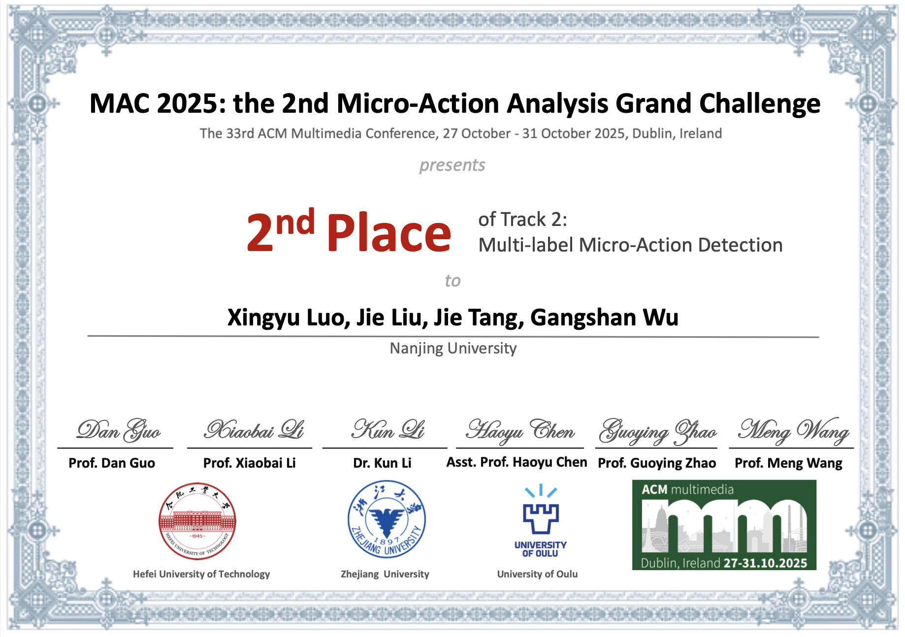
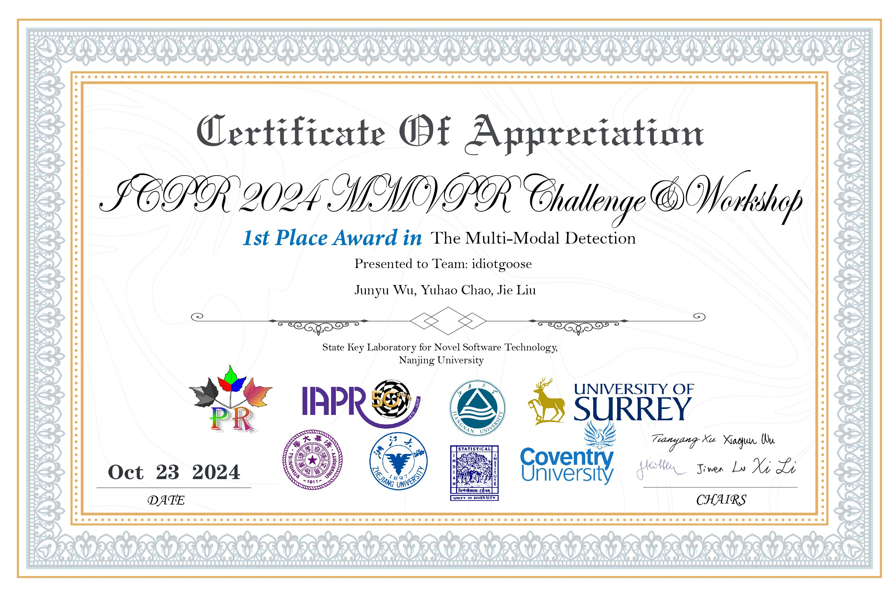
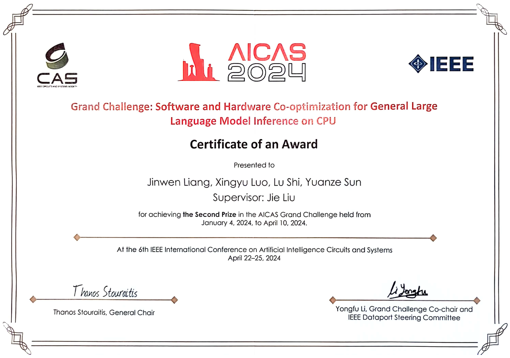
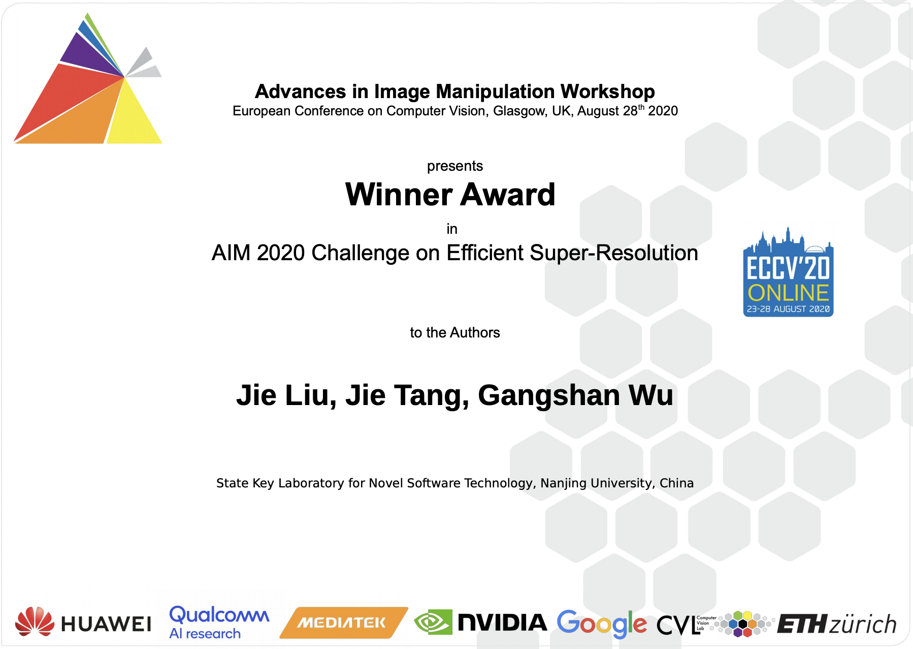

🐳 本人即将入职智能科学与技术学院担任助理教授，现招收2026年推免直博1~2名，硕士2~3名，欢迎与我（liujie@nju.edu.cn）联系。

## Biography
I will be working as an Assistant Professor at the School of Intelligence Science and Technology, Nanjing University. I am also a member of the [Multimedia Computing Group (MCG)](http://mcg.nju.edu.cn/), working with [Prof.Jie Tang](http://mcg.nju.edu.cn/) and [Prof.Limin Wang](https://wanglimin.github.io/). Previously, I obtained my Ph.D. at the Department of Computer Science and Technology, Nanjing University, China, in Sep. 2022. Before that, I received my master's degree in the Department of Computer Science and Technology at Nanjing University, China, in Jue. 2018 and B.E degree from the Department of Computer Science and Technology, Nanjing University, China, in Jue. 2015.

My research interest broadly includes machine learning and computer vision. Specifically, I focus on image/video restoration (e.g., super-resolution), video interpolation, pose estimation, visual tracking, etc. 

Currently, I am more interested in multi-modal learning and efficient machine learning, including embodied intelligence, open scene perception, and large model acceleration, etc.

## 🔥 Recent News
* 2026.02: **Our paper [Disentangled Textual Priors for Diffusion-based Image Super-Resolution](https://arxiv.org/abs/2603.07430) was accepted by CVPR 2026 (CCF-A). Congratulations Lei Jiang!**
* 2026.01: **Our paper [GLAD: Generative Language-Assisted Visual Tracking for Low-Semantic Templates](https://link.springer.com/article/10.1007/s11263-026-02774-7) was accepted by IJCV (CCF-A). Congratulations Xingyu Luo!**
* 2025.12: **“挑战杯”获奖作品被《扬子晚报》追踪报导！**[链接](https://wap.yzwb.net/wap/news/4891087.html)
* 2025.11: **恭喜研一的张明轩、陈宇宁、张朱昊、孙飞宇、李嘉伟同学获得第十九届“挑战杯”全国大学生课外学术科技作品竞赛 “人工智能+”挑战赛 全国特等奖！**[链接](https://mp.weixin.qq.com/s/Rzbuh9of7G2_tolubgal-Q)
* 2025.11: **恭喜大三的周擎、黄伟轩、程启航、陈巧、刘鑫鑫同学获得第十九届“挑战杯”全国大学生课外学术科技作品竞赛 2025年度“揭榜挂帅”专项赛 全国三等奖！**[链接](https://mp.weixin.qq.com/s/si2J3FAXIx3eScu7UDhzHg)
* 2025.10: **Win the 2nd place in the MAC 2025: the 2nd Micro-Action Analysis Grand Challenge @ MM2025! 恭喜罗星宇同学（研一）！**
   * 🥈🥈🥈
   
 
   
	

* 2025.09: **恭喜许煜恒同学《面向LUT超分辨率模型的纹理增强与存储压缩技术研究 》获批国家自然科学基金青年学生基础研究项目（本科生）!**
* 2025.06: **Our ACL paper was selected as Oral Presentation!**
* 2025.05: **One paper was accepted by ACL 2025 Main (CCF-A). Congratulations Tianrui Pan!**
* 2025.03: **One paper was accepted by Neural Networks (CCF-B). Congratulations Shijie Yang!（研二）**
* 2025.03: **One paper was accepted by ICME 2025 (CCF-B). 恭喜吴隽雨（大三）同学!**:
* 2025.02: **Two papers were accepted to CVPR 2025 (CCF-A). 恭喜刘鑫（研二）和许煜恒（大三）同学!**:
* 2024.11: **恭喜梁锦文（大四）、罗星宇（大四）、陈依言（大三）获得第十九届“挑战杯”全国大学生课外学术科技作品竞赛 2024年度“揭榜挂帅”专项赛 全国三等奖！**
* 2024.10: **Win the 1st place in the Multi-Modal Visual Pattern Recognition Challenge # Track 2 @ ICPR2024! 恭喜吴隽雨（大三）& 晁宇豪（大三）！**
   * 🥇🥇🥇
   
 
	
	

* 2024.10: **恭喜林彦铠同学（大三）获得昇腾AI原生创新算子挑战赛（S2赛季）优秀奖！**
* 2024.08: **Invited to serve as a reviewer for AAAI & ICLR 2025.**
* 2024.07: **One paper was accepted to ACM MM 2024. Congratulations Tianrui Pan!**
* 2024.07: **One paper was accepted to ECCV 2024. Congratulations Haonan Wang!**
* 2024.05: **Invited to serve as a reviewer for NeurIPS 2024.**
* 2024.04: **梁锦文、罗星宇、石璐、孙源泽同学赴阿联酋·阿布扎比参加AICAS Grand Challenge 2024**
* 2024.04: 🎊 **指导的21级本科生获得天池[“AICAS 2024：通用算力大模型推理性能软硬协同优化挑战赛”](https://tianchi.aliyun.com/competition/entrance/532170?spm=a2c22.12281957.0.0.4c886d94Fr3gDe&lang=zh-cn)第二名的优异成绩（USD 3000）。恭喜梁锦文、罗星宇、石璐、孙源泽同学！**
   * 🥈🥈🥈
	
 
	
	

* 2023.12: **One paper was accepted to AAAI 2024 (CCF-A). Congratulations Chao Chen!**:
* 2023.11: **Invited to serve as a reviewer for CVPR 2024.**
* 2023.08: 🎊 **恭喜指导的21级本科生石璐和梁锦文同学在天池算法竞赛平台上举办的[“AFAC2023-金融数据验真-金融文档防篡改挑战赛”](https://tianchi.aliyun.com/competition/entrance/532096/introduction)中获得季军的优异成绩（¥10000）**
   * 🥉🥉🥉 
	
 
	
	

* 2023.08: **荣获AFAC2023金融智能挑战赛“优秀指导教师”!**
* 2023.07: **One paper was accepted to ACM MM 2023 (CCF-A). Congratulations Haonan Wang!**:
  * ["Lightweight Super-Resolution Head for Human Pose Estimation"](https://arxiv.org/abs/2307.16765). Haonan Wang, **Jie Liu\***, Jie Tang, and Gangshan Wu. (**\*** indicates corresponding author) 
* 2023.07: **One paper was accepted to ICCV 2023 (CCF-A). Congratulations Yidong Cai!**:
  * ["Robust Object Modeling for Visual Tracking"](https://arxiv.org/abs/2308.05140). Yidong Cai, **Jie Liu\***, Jie Tang, and Gangshan Wu. (**\*** indicates corresponding author) 
* 2023.04: **One paper was accepted to IJCAI 2023 (CCF-A). Congratulations Chang Zhou!**:
  * [Video Frame Interpolation with Densely Queried Bilateral Correlation](https://arxiv.org/abs/2304.13596). Chang Zhou, **Jie Liu\***, Jie Tang, and Gangshan Wu. (**\*** indicates corresponding author) 
* 2022.11: One paper was accepted to AAAI 2023 (CCF-A):
  * [From Coarse to Fine: Hierarchical Pixel Integration for Lightweight Image Super-Resolution](https://arxiv.org/abs/2211.16776). **Jie Liu**, Chao Chen, Jie Tang, and Gangshan Wu. 
* 2021.07: 🎊 Honorable Mention Award 
	* We won the Honorable Mention Award of the [CVPR MAI 2021 Quantized Image Super-Resolution Challenge](https://ai-benchmark.com/workshops/mai/2021/).
* 2020.07: 🎊 Winner Award 🏆
   * We won the first prize of the [ECCV AIM 2020 Efficient Super-Resolution Challenge](https://data.vision.ee.ethz.ch/cvl/aim20/).
   

	
	

* 2020.07: One paper was accepted to ACM MM 2020 (CCF-A).
  * [Memory Recursive Network for Single Image Super-Resolution](https://dl.acm.org/doi/abs/10.1145/3394171.3413696). **Jie Liu**, Minqiang Zou, Jie Tang, Gangshan Wu.
* 2020.02: One paper was accepted to CVPR 2020 (CCF-A).
  * [Residual Feature Aggregation Network for Image Super-Resolution](https://openaccess.thecvf.com/content_CVPR_2020/html/Liu_Residual_Feature_Aggregation_Network_for_Image_Super-Resolution_CVPR_2020_paper.html). **Jie Liu**, Wenjie Zhang, Yuting Tang, Jie Tang, Gangshan Wu.
  
## Research Topics
* Low-Level
	* Super-resolution for video streaming
	* Super-resolution for mobile devices 
	* Real-world super-resolution
	* Efficient/Mobile image/video generation
* MLLM & LLM
	* MLLM/LLM for mobile devices
	* MLLM for image quality assessment
* Understanding
	* Degraded image understanding
	* Multi-modal tracking  	
* Audio & Speech
	* Audio-visual speech separation
	* Audio-visual active speaker detection 
	* Dialog agent 
* Embodied Perception
	* Visual-Audio Navigation (VAN)
	* Embodied dialog localization

## Funds and Projects
* 国家青年科学基金项目(C类)，2025-01-01 至 2027-12-31，主持
*  江苏省青年基金项目，2024-09 至 2027-08，主持
*  科技创新2030-“新一代人工智能”重大项目，通用视频理解的基础模型与方法体系，2023-01 至 2025-12，参与
*  国家重点研发计划-课题，参与

## Honors and Awards
* National Scholarships for Doctoral Students （博士研究生国家奖学金）
* Supported by the program B for
Outstanding PhD candidate of Nanjing University （南京大学提升B计划）
* AFAC2023金融智能挑战赛“优秀指导教师”

## Teaching
* 计算机系统基础（ICS）
	* 2025年秋季学期（计算机+AI+匡院 PA实验）
	* 2024年秋季学期（计算机+AI+匡院 PA实验）
	*  2023年秋季学期（PA实验） 
	*  2023年春季学期（理论部分）
* 教学论文
	* 袁春风，苏 丰，吴海军，余子濠，汪 亮，刘 杰，朱光辉，"计算机系统导论课程实践项目及实践体系建设"，《计算机教育》
* 教材出版
	* 《计算机系统实践教程：基于x86+Linux平台》，苏 丰，汪 亮，刘 杰，王慧妍，朱光辉，余子濠，鲍培明，袁春风

## Academic Services
* Reviewer
  * ICLR 2025, CVPR 2025, ICML 2025, ICCV 2025, MM 2025, NeurIPS 2025
  * CVPR 2024, ECCV 2024, MM 2024, ACCV 2024, NeurIPS 2024
  * CVPR 2023, ICCV 2023
  * ECCV 2022, CVPR 2022 
  * ICCV 2021, CVPR 2021, AAAI 2021 
  * IEEE TMM, IEEE TCSVT, IJCV, TIP
  * ...
  
## Alumni
* 2024
	* 陈超（百度），蔡益东（字节），王浩男（腾讯），周畅（无锡天一中学）